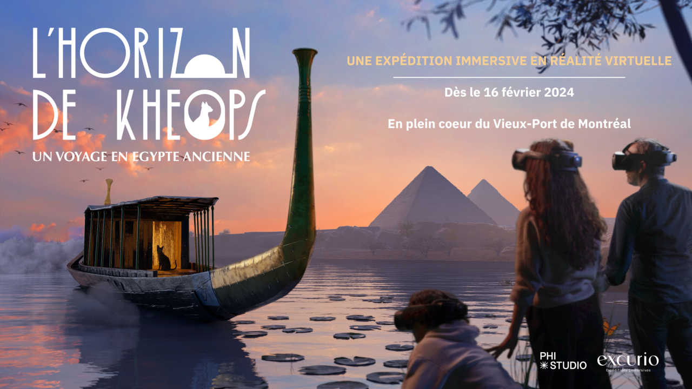
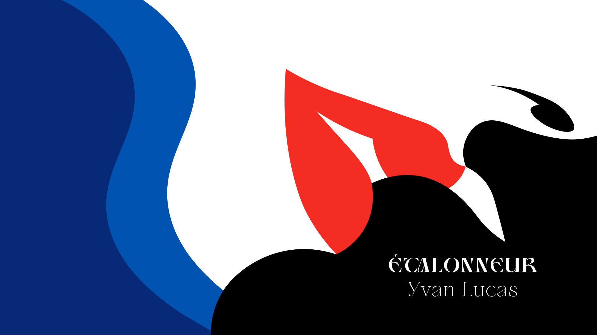

# Élodie Lajeunesse #

## Intérêts dans le multimdédia ##
Je m’intéresse particulièrement au montage vidéo, à la réalité virtuelle et à l’illustration numérique. J’ai eu l’occasion de participer à des expériences de VR à Montréal: Mondes disparus et L’Horizon de Khéops, que j’ai énormément appréciées. Ces expériences m’ont donné la forte impression d’être plongé dans des univers totalement différents.

J’aimerais améliorer mes compétences en montage vidéo, que ce soit pour des vidéos YouTube ou des bandes-annonces de films. Les effets spéciaux utilisés dans les trailers ainsi que les animations de texte et les transitions m’intéressent particulièrement et j’aimerais en apprendre davantage à ce sujet.

En illustration numérique, j’apprécie le style Nouvel Art, découvert lors de mon projet de crédits de film. Ce style me correspond bien, car il est coloré sans être trop complexe, ce qui correspond davantage à mes goûts artistiques.

Expériences VR:

Mon projet de crédits de film:

