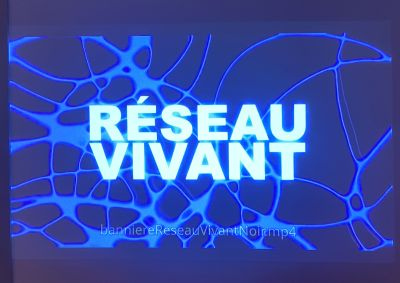

# TERMINAL - Réseau vivant
## Grand studio du programme TIM
- Exposition de type interactive
- 
>24 février et 17 mars 2026 - Terminal - Réalisé en 2026
>

## Nom de l'artiste ou de la firme
- Émeryk Bélisle
- Elie Daher
- Ting Yung Lu Terry
- Dana Saavedra-Torrano
- Mégane Ranger

TERMINAL est un jeu collaboratif interactif où jusqu’à 6 joueurs jouent ensemble avec leur téléphone comme manette.
Le but est de se déplacer dans un réseau numérique en évitant des obstacles. Chaque joueur laisse une trace derrière lui, et ça devient un danger pour les autres.
Il faut donc vraiment bien communiquer et faire attention. Si une personne perd, tout le monde recommence ce qui rend le jeu plus intense.
Plus on avance, plus ça devient difficile avec des nouveaux obstacles et mécaniques, ce qui rend l’expérience immersive.

### Éléments nécessaires à la mise en exposition
- Projecteur + mur de projection
- Système audio (haut-parleurs, câbles)
- Réseau Wi-Fi
- Espace pour plusieurs joueurs

### Espacement
(croquis)

### Expérience vécue
- C'était stressant mais amusant. Un peu rageant lorsqu'on devait toujours recommencer. On pouvait vivre l'expérience de façon confortable sur les poufs.

### Ce que j'ai aimé
- J'ai aimée le coté collaboratif et que chaque joueur soit important. J'ai beaucoup aimé que nos téléphones servent de manette pour le jeu, c'est efficace.

### Ce que je ferais autrement
- Je ne changerais pas grand-chose parce que j'ai aimé le projet. Peut-être juste ajouter plus de variété visuelle pour rendre le jeu plus intéressant.

### Références :
https://pythons-5.github.io/Terminal/#/
