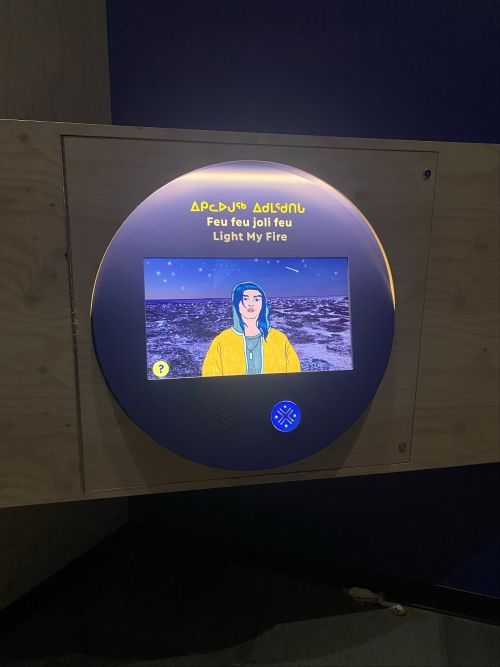
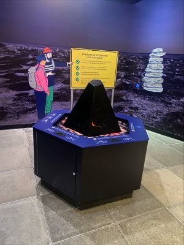
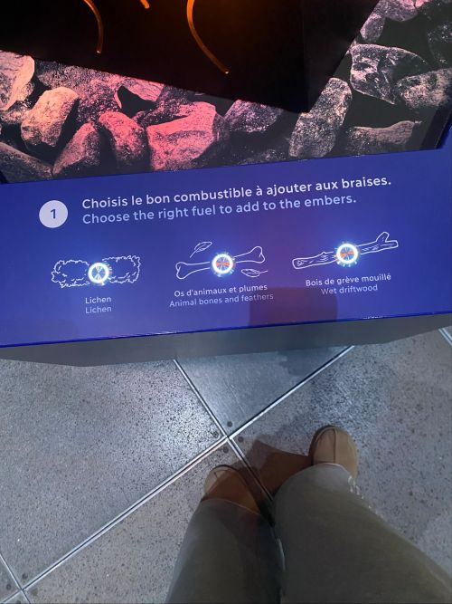
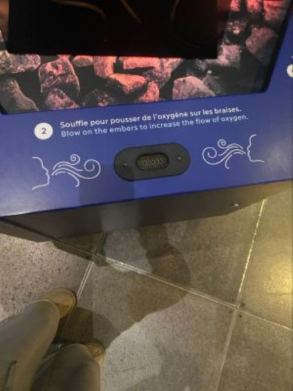
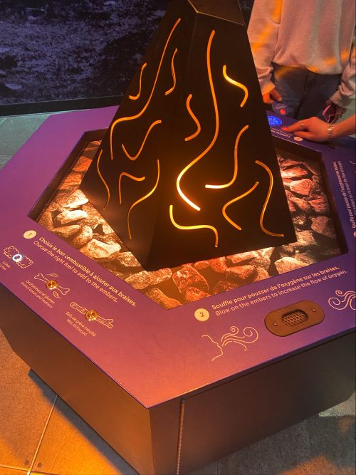

# Nanualuk – Expédition Nordique
## Centre des sciences de Montréal
### Feu feu joli feu

>2 avril 2026 - Feu feu joli feu - Réalisé en 2025
>
## Type d’exposition
C’est une exposition interactive. On peut participer directement au dispositif au lieu de juste regarder.

## Fonction du dispositif multimédia
Le dispositif sert comme support pédagogique. Il apprend aux visiteurs comment allumer un feu correctement et de façon sécuritaire.

---

## Mise en espace

L’installation est placée au centre d’un espace ouvert. Le dispositif en forme de “volcan” est au milieu sur une base hexagonale. Les instructions sont autour (étapes 1, 2, 3). À l’arrière, il y a un visuel du paysage nordique qui ajoute à l’ambiance.

---

## Composantes et techniques
- Structure en forme de volcan avec lumières LED  
- Capteur pour détecter le souffle  
- Zones tactiles pour choisir le combustible  
- Écran avec animation  
- Système sonore  
- Capteurs interactifs  

---

## Éléments nécessaires à la mise en exposition
- Socle solide  
- Alimentation électrique  
- Câbles et système électronique cachés  
- Signalisation (instructions)  
- Espace sécuritaire pour circuler  

---

## Expérience vécue
  
  

Le visiteur doit suivre les étapes : choisir un combustible, souffler dans le capteur, puis interagir avec le cercle pour récupérer la récompense. Le feu réagit directement, ce qui rend l’expérience vraiment engageante. J’ai trouvé ça fun parce qu’on participe vraiment au lieu de juste regarder.

---

## Ce qui m’a plu
J’ai aimé le côté interactif et simple à comprendre. Le fait de souffler rend l’expérience plus réaliste. Les lumières du feu sont aussi très réussies et immersives. Ça m’a donné des idées pour créer des projets interactifs.

---

## Ce que je ferais autrement
J’ajouterais plus de feedback quand on se trompe pour mieux comprendre les erreurs. Aussi, rendre l’activité un peu plus longue ou avec plus d’étapes.

---

## Références
Photos prises par moi au Centre des sciences de Montréal  
Exposition : Nanualuk – Expédition nordique
