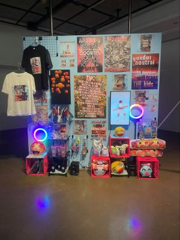
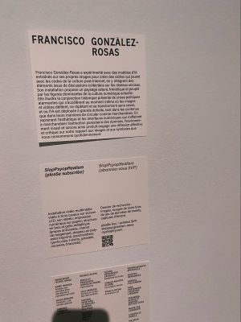
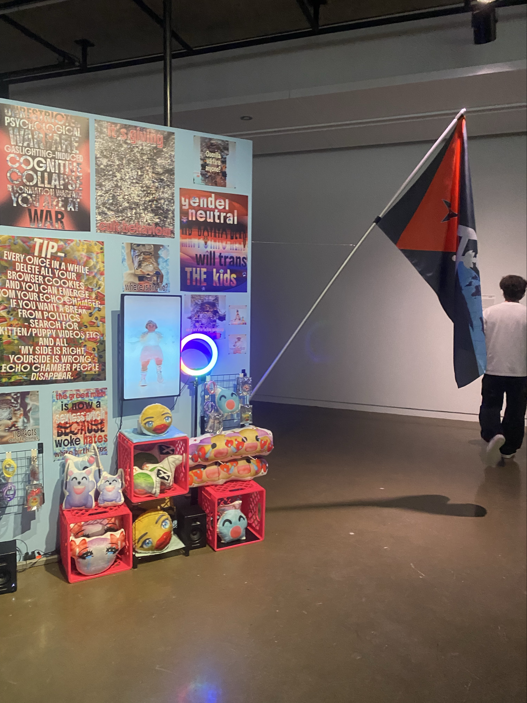
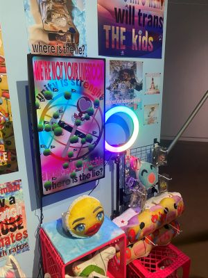
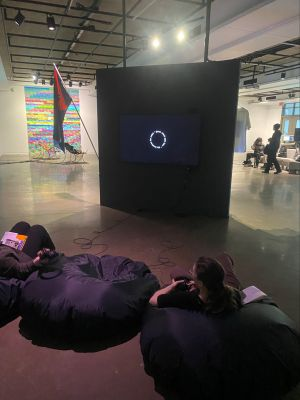

# Devenir partagés pratique de l'IA
## Galerie d'Art Université de Montréal
### SlopPsyopRealism (Plea$e subscribe) - Francisco González-Rosas
 
>29 janvier 2026 - SlopPsyopRealism (Plea$e subscribe) - Réalisé en 2025
>
- Exposition de type complative portant sur les pratiques artistiques liées à l’intelligence artificielle.
- L'oeuvre prend la forme d'une installation multimédia composée d'écrans, de haut-parleurs et d'éléments visuels rappelant l'esthétique des réseaux sociaux. Des images générées par l'intelligence artificielle sont projetées en continu avec la narration d'un chatbot.
  
 

 
- Sur le coté de l'installation, on y trouve un drapeau qui représente une dimension politique à l'oeuvre. Ces éléments rappellent la présence de contenu politique sur les réseaux sociaux mêlés à d'autres types d'images. Les émotions du public face à cet enjeu sont représentées par les emojis, des symboles de réaction qu'on retrouve en ligne. C'est l'opinion du public qui se transforme en art.

 

 
 
- L’installation est disposée de manière à permettre au spectateur de circuler autour de l’œuvre, offrant différents points de vue selon la position du spectateur.
