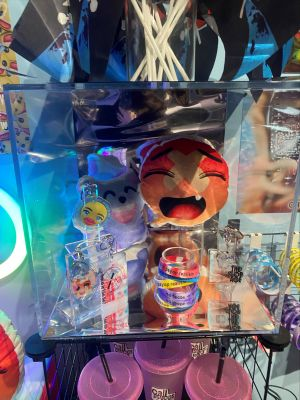

# Devenir partagés pratique de l'IA
## Galerie d'Art Université de Montréal
### SlopPsyopRealism (Plea$e subscribe) - Francisco González-Rosas
 
>29 janvier 2026 - SlopPsyopRealism (Plea$e subscribe) - Réalisé en 2025
>
- Exposition de type complative portant sur les pratiques artistiques liées à l’intelligence artificielle.
- L'oeuvre prend la forme d'une installation multimédia composée d'écrans, de haut-parleurs et d'éléments visuels rappelant l'esthétique des réseaux sociaux. Des images générées par l'intelligence artificielle sont projetées en continu avec la narration d'un chatbot.
  
 

 
 
- L’installation est disposée de manière à permettre au spectateur de circuler autour de l’œuvre, offrant différents points de vue selon la position du spectateur.

 

 
- Sur le côté de l’installation, on voit beaucoup d’images, d’objets et de symboles qui rappellent l’univers des réseaux sociaux. Le drapeau ajoute une dimension politique et montre comment le contenu politique se mélange souvent au divertissement en ligne. Les emojis représentent les réactions du public et montrent comment l’opinion des gens peut être représentée sous forme d'art.
