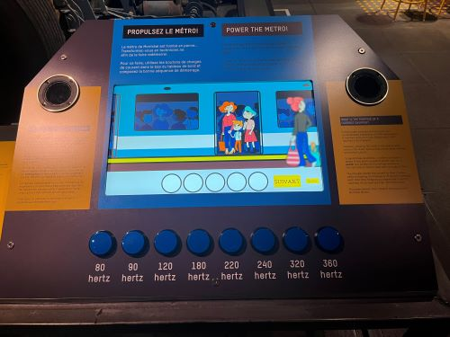

# Compte-rendu de la conférence – Musée de l’ingéniosité

## Conférence de M. Boucher

Lors de cette conférence, M. Boucher a présenté le travail réalisé au Musée de l’ingéniosité, en expliquant comment sont conçus des dispositifs interactifs multimédias. Il a abordé les domaines impliqués comme l’informatique, la programmation, la production audiovisuelle ainsi que la gestion de projet. Il a aussi expliqué l’importance de travailler en équipe pour résoudre des problèmes et créer des expériences engageantes pour les visiteurs.

Un des exemples présentés est le dispositif du métro de Montréal. Celui-ci est interactif et permet aux visiteurs de recréer la mélodie du métro en appuyant sur différents boutons associés à des fréquences (hertz). Les couleurs utilisées sont inspirées du métro de Montréal, ce qui renforce le lien avec la réalité. Ce projet utilise des outils comme After Effects et Max/MSP pour gérer le son et les interactions. Cela montre bien comment la technologie et le design peuvent être combinés pour créer une expérience immersive.

M. Boucher a aussi parlé de certains défis, comme le langage scientifique parfois difficile à comprendre pour le public ou encore des problèmes techniques comme le son instable. Cependant, il a mentionné que les installations attirent beaucoup de visiteurs et que l’interactivité fonctionne très bien.

En conclusion, la conférence était intéressante et inspirante, car elle montrait concrètement comment créer des projets multimédias interactifs. J’ai particulièrement aimé les exemples réels comme celui du métro, car ils rendent les explications plus claires et concrètes.

>Source : Centre des sciences de Montréal
