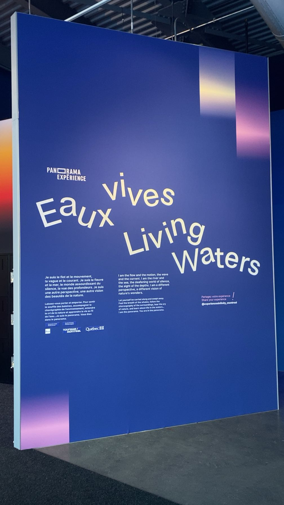
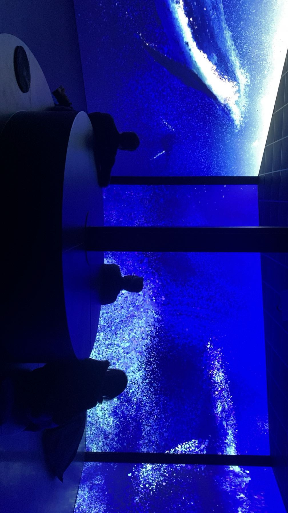
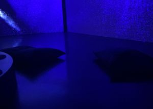

# Panorama Expérience - Grand Quai du Port de Montréal
# Eaux Vives - Échos de l'esprit de la baleine
- Exposition de type contemplative et immersive portant sur la relation entre l’humain et la nature, plus particulièrement l’eau et les écosystèmes aquatiques. Accessible du 24 février au 31 décembre 2026.
- 
>27 février 2026 - Eaux Vives - Réalisé en 2025
>
- L’œuvre prend la forme d’une installation multimédia composée de projections géantes, de sons ambiants et d’images en mouvement. Des paysages aquatiques, des vagues, des animaux marins et différents environnements liés à l’eau sont projetés en continu afin de créer une atmosphère immersive. Le spectateur se promène dans l’espace et observe les images et les sons qui l’entourent pour but de plonger le public au coeur de l'univers aquatique.

### Projection 1
 
- La première projection se déroule dans une salle avec un seul écran. L’œuvre représente ce que voit une baleine qui est presque aveugle. L’image projetée est donc floue, avec des couleurs en mouvement qui rappellent les déplacements de l’eau. On entend aussi les sons que les baleines perçoivent, comme les bruits de l’océan et les chants de baleines. L’expérience invite les visiteurs à fermer les yeux et écouter, afin de vivre une expérience similaire à celle de la baleine qui se repère surtout grâce au son. Dans la salle, il y a un projecteur au plafond, deux haut-parleurs, deux poufs pour s’asseoir et un banc qui vibre lorsque la baleine respire.

### Projection 2
- La deuxième projection montre l’esprit de la baleine et ce qu’elle perçoit grâce au son. On voit des mouvements d’eau et des formes qui se transforment en petites particules lorsque les animaux marins se déplacent ou se décomposent. Les particules se déplacent en vagues ce qui rappelle l’environnement aquatique. La salle utilise plus de quatre haut-parleurs placés autour de l’espace, ce qui donne l’impression d’être à l’intérieur de l’esprit de la baleine. On entend les bruits de l’eau et de la respiration. Il y a deux poufs et un banc vibrant ainsi que trois écrans avec trois projecteurs.

### Espacement

### Ce que j'ai aimé
J’ai beaucoup aimé l’exposition parce qu’elle était très immersive. Les sons, les images et les bancs qui vibraient rendaient l’expérience très réaliste. J’ai surtout aimé la projection sur la baleine parce qu’on pouvait comprendre comment elle perçoit le monde.

### Ce que je ferais autrement
Je ne changerais pas grand-chose parce que j’ai vraiment aimé l’exposition. Peut-être ajouter des effets de vagues sur le sol lorsqu'on marche.

### Mon expérience vécue
Pendant ma visite de Panorama Expérience – Eaux vives, je me suis sentie plongée dans l’univers de l’océan grâce aux sons et aux projections. C’était une expérience à la fois relaxante et intéressante.

### Références
https://www.mtl.org/fr/quoi-faire/festivals-et-evenements/panorama-experience-eaux-vives
